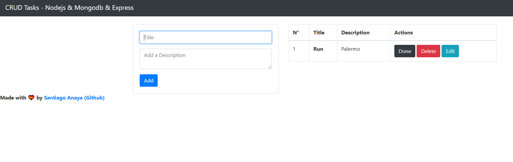

# express-tasks
Task list to mark them as Done, Edit and Delete them. Using Node.js & Mongodb & Express.js

Install dependencies with ```npm i```
Start with ```npm run dev```

## Tutorial by Fazt
Source video: [CRUD de Express y Mongodb | Aplicación de Tareas](https://www.youtube.com/watch?v=JvniI1zYnQ4&t=851s)

## Demo working

